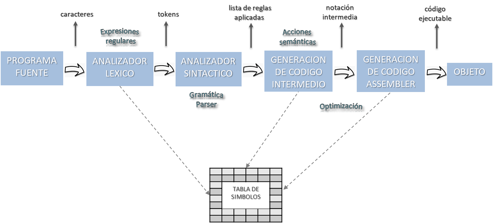
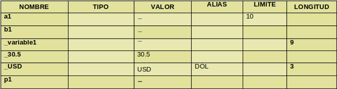

# Lenguajes y compiladores

## Proceso de compilación

### ¿Que ess la compilación?
La compilación es un proceso destructivo en el cual el programa fuente se transforma por completo (o casi) en un lenguaje que la máquina comprende y ejecuta (objeto).
Ningun lenguaje tiene un compilador o un interprete que es totalmente un traductor o un interprete.

### Etapas de la compilación

* Analisis lexico
* Analisis sintactico
* Generador de codigo intermedio
* Generador asembler
* (Opcional) optimizador
 
  
 
## Analizador lexico

El analizador lexico lee el programa fuente y agrupa los caracteres en unidades llamadas __tokens__. Cada token es una secuencia de caracteres que forman una unidad significativa. Estos _tokens_ son compartidos con el __analizador sintactico__ cuando este lo requiere.
El analizador lexico no retorna una lista de token, sino que retorna un token cada vez que el sintactico se lo pide.

### Token vs Lexema
* __Token__: Es una secuencia de caracteres que forman una unidad significativa. La unidad significativa puede ser una operación de asignación, una identificación, una costante, un operador de suma o resta, etc. El _token_ se diferencia de la cadena de caracteres que representa.
* __Lexema__: Es la cadena de caracteres que representa el token, tambien es llamado valor lexico. Este puede ser un =, (, variable_a, numero_de_pedido, 32, 54, *, -.

Existen tokens que se corresponden con un único lexema:

    OP_ASIG -> =
    PAR_AB -> (

Existen tokens que pueden representar mas de un lexema:

    IDENTIFICADOR -> precio, temperatura, cantidad
    CONSTANTE -> 100, 21, 53, 1945

### Tabla de simbolos

Puesto que un token puede representar más de un lexema, el A.L. (Analizador Léxico) debe enviar información adicional al A.S. (Analizador Sintáctico), en forma de atributo/s. Esa información será usada en las próximas etapas del compilador.

En la práctica, esta información adicional para cada token que genere más de un lexema se almacena en una Tabla de Símbolos, y los atributos de cada token difieren de acuerdo a sus características. La Tabla de Símbolos se puede implementar con una estructura de datos que contiene un registro para cada token que pueda representar más de un lexema y los atributos del mismo

### Funcionamiento

Un analizador léxico se basa en el diseño de un autómata finito (grafo con estados finitos y transiciones entre ellos). El Analisador léxico es una función que lee carácter a carácter la entrada (programa) y va recorriendo el autómata hasta que reconoce un token , esto último sucede cuando llega a un estado final.
Una vez que reconoció un componente léxico o token devuelve el tipo de token reconocido ó un error y en general es invocada cada vez que el analizador sintáctico requiere que se chequee la sintaxis de un token.

#### Funciones

* Reconocer tokens
* Eliminar blancos, tabulaciones, newlines
* Llevar la cuenta de los saltos de línea, para correlacionar los mensajes de error con el programa fuente
* Expandir macros
* Eliminar comentarios
* Informar errores léxicos (Ej: caracter inválido durante el mapeo de los símbolos de entrada, constante fuera de rango, identificador excede el tamaño determinado, comentario sin cerrar, etc)
